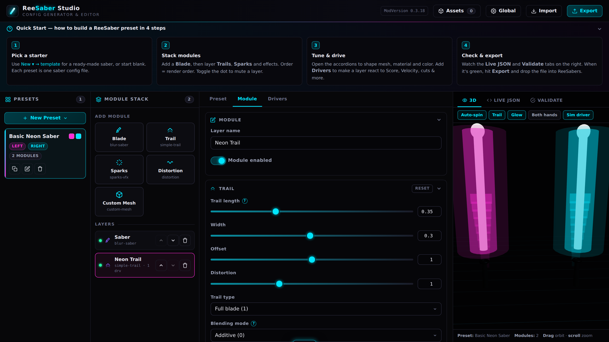

# ReeSaber Studio

> A visual, single‑file config generator & editor for the [ReeSabers](https://beatleader.wiki/en/reesabers/start) Beat Saber mod.

ReeSaber Studio lets you design ReeSabers presets in your browser — stack modules, tune materials, wire up gameplay‑reactive drivers, drop in your own 3D meshes and textures, and export a ready‑to‑use `.json` config. No build step, no install, no backend. The entire app is one self‑contained HTML file.

<!--
  📸 SCREENSHOT PLACEHOLDER
  A screenshot ships at docs/screenshot.png — replace it with your own capture any time.
  Just overwrite that file (keep the name) or point the src below at a new path.
-->


---

## What it does

ReeSabers presets are deeply nested JSON files describing sabers as stacks of **modules** (blade, trail, sparks, distortion…), each with meshes, materials, color overrides, and event‑driven **drivers**. Hand‑editing that JSON is painful. ReeSaber Studio turns it into a visual editor with a live preview and safety rails, then generates schema‑correct JSON for **ReeSabers `0.3.18`**.

### Features

- **Preset management** — create, duplicate, rename, and delete presets; assign each to the Left hand, Right hand, or both; set custom colors with in‑game color‑sync options.
- **Module stack builder** — add Blade, Trail, Sparks, Distortion, and Custom Mesh layers; reorder, mute, and delete them. Order is render order.
- **Driver builder** — bind live values (Score, Velocity, Cut Direction, Hand Position X/Y/Z, Time After Miss, Time Loop) to a layer's alpha, scale, and color, with a live response‑curve preview.
- **Custom asset pipeline** — drag‑and‑drop your own meshes (`.obj` / `.glb` / `.gltf`), textures (`.png` / `.jpg`), and sounds (`.wav` / `.ogg`). Assets are read in‑browser, previewed live, and embedded (base64) into the exported config so presets stay self‑contained.
- **Live 3D preview** — a Three.js viewport renders your saber(s) in real time, including custom meshes, trails, particles, color overrides, and a simulated driver pulse.
- **In‑app documentation** — contextual `?` help cards on every technical field, a collapsible Quick Start guide, and accordion‑grouped controls.
- **QA & validation** — a side‑by‑side live JSON inspector, enforced safe min/max on every slider with per‑panel *Reset to Safe Default*, real‑time validation (missing layers, dangling asset references, out‑of‑range values), and a pre‑export check.
- **Import / export** — load an existing ReeSabers `.json` to edit it, or save a full **Studio project** bundle (presets + assets + settings) to pick up later.
- **Dark, high‑contrast UI** — a true‑black cyberpunk theme with an embedded SVG favicon.

---

## Getting started

There is **nothing to install or build.** The app is a single HTML file with one optional CDN dependency (Three.js, for the 3D preview).

### Option 1 — just open it

Download [`index.html`](index.html) and open it in any modern browser (Chrome, Edge, Firefox). That's it. An internet connection is only needed for the live 3D preview; every other feature (editing, assets, validation, import, export) works fully offline.

### Option 2 — run a local server (recommended for asset work)

Some browsers restrict `file://` pages. Serving over `http://` avoids that:

```bash
# clone the repo
git clone https://github.com/<your-username>/reesaber-studio.git
cd reesaber-studio

# then serve with any static server, e.g. Python:
python -m http.server 8000
# ...and open http://localhost:8000
```

### Option 3 — host it on GitHub Pages

This repo ships a GitHub Actions workflow that publishes the app to GitHub Pages automatically. In your repo, go to **Settings → Pages → Build and deployment → Source: GitHub Actions**, then push to `main`. Your app will be live at `https://<your-username>.github.io/reesaber-studio/`.

---

## How to use it

1. **Pick a starter.** Use **New ▾** to choose a template — *Basic Neon Saber*, *Reactive Velocity Saber*, or *Custom Mesh Template* — or start from a blank preset. Each preset becomes one ReeSabers config file.
2. **Stack modules.** In the **Module Stack** column, add a Blade, then layer Trails, Sparks, and effects on top. Drag order = render order. Toggle the green dot to mute a layer without deleting it.
3. **Tune it.** Select a layer and open the accordion panels to shape its mesh, material/shader, color override, and transform. Every slider is clamped to a safe range and each panel has a **Reset** button.
4. **Add drivers.** On the **Drivers** tab, attach a driver to make a layer react to gameplay — e.g. a *Velocity* driver that brightens your trail the faster you swing. The response curve updates as you tune.
5. **(Optional) Bring your own assets.** Open **Assets**, drop in a `.obj`/`.glb`/`.gltf` model or a `.png`/`.jpg` texture, then assign it to a module's **Custom mesh** or **Custom texture** slot.
6. **Check & export.** Watch the **Live JSON** and **Validate** tabs on the right. When it's green, hit **Export → Download active preset** and drop the file into:

   ```
   Beat Saber/UserData/ReeSabers/Presets/
   ```

   Then select it from the ReeSabers in‑game menu.

> 💾 **Tip:** Use **Export → Studio project** to save your full working state (all presets, uploaded assets, colors, and global settings) as a single JSON you can re‑import here later.

---

## Config format & compatibility

ReeSaber Studio targets the **ReeSabers `0.3.18`** preset schema. Exported files use the mod's real structure:

```jsonc
{
  "ModVersion": "0.3.18",
  "Version": 1,
  "RootSettings": { "Type": 0 },
  "LocalTransform": { "Position": {…}, "Rotation": {…}, "Scale": {…} },
  "Modules": [
    {
      "ModuleId": "reezonate.blur-saber",
      "Version": 2,
      "Config": { /* mesh, material, drivers, color override … */ },
      "Children": []
    }
  ],
  "BinaryAssets": { "Textures": [], "Geometry": [] }
}
```

**A note on custom assets:** ReeSabers' exact on‑disk format for *embedded* binary meshes/textures isn't publicly documented. ReeSaber Studio stores uploaded assets under `BinaryAssets` as `{ Id, Name, Format, Data(base64) }` and references them by id from the owning module — a clean, self‑contained structure that round‑trips perfectly within Studio. If you have a real ReeSabers export that already embeds a custom asset, open an issue with a sample and the exporter can be aligned to it exactly.

Likewise, driver *value‑type* integers are mapped to friendly names via a documented table in the source (`DRIVER_SOURCES`). Imported presets preserve their original `valueType` verbatim; new drivers use that table, which is a one‑line change if the ordering needs adjusting.

---

## Project structure

```
reesaber-studio/
├── index.html                         # the app (entry point for GitHub Pages)
├── ReeSaber-Config-Generator.html     # identical copy with a descriptive name
├── docs/
│   └── screenshot.png                 # README hero image — replace with your own
├── .github/workflows/
│   └── pages.yml                      # auto-deploy to GitHub Pages
├── README.md
├── CHANGELOG.md
├── CONTRIBUTING.md
├── LICENSE
└── .gitignore
```

`index.html` and `ReeSaber-Config-Generator.html` are the same file — keep whichever entry point you prefer. The app has **no build system and no npm dependencies**; edit the HTML directly.

---

## Tech

- Vanilla JavaScript, HTML, and CSS in a single file — no framework, no bundler.
- [Three.js](https://threejs.org/) `r128` (via CDN) for the live 3D preview and OBJ/GLTF loaders.
- Browser `FileReader` + base64 data URIs for the custom asset pipeline.

---

## Roadmap ideas

- More module types as ReeSabers adds them.
- Full control‑point curve editing (beyond from→to endpoints).
- Alignment of the embedded‑asset format to a confirmed ReeSabers sample.
- A gallery of shareable community presets.

Contributions welcome — see [CONTRIBUTING.md](CONTRIBUTING.md).

---

## Acknowledgements

- The [ReeSabers](https://beatleader.wiki/en/reesabers/start) mod by the BeatLeader team.
- Preset schema referenced from community presets such as [iza‑ttv/ReeSabers‑presets](https://github.com/iza-ttv/ReeSabers-presets) and the [ReeSabers wiki](https://beatleader.wiki/en/reesabers/settings).

This is a community tool and is **not affiliated with or endorsed by** the ReeSabers authors, BeatLeader, or Beat Games.

## License

Released under the [MIT License](LICENSE).
