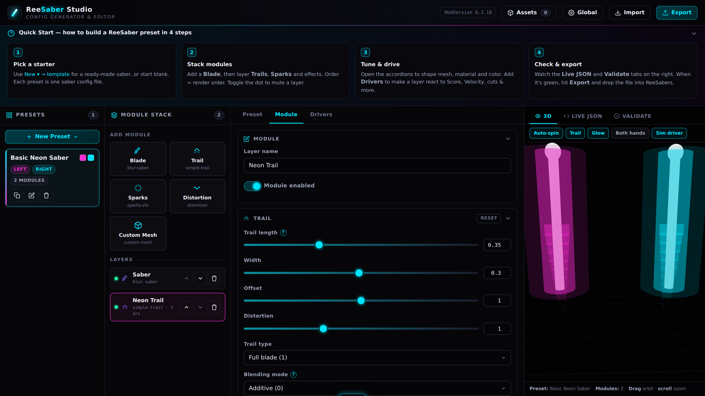

# ReeSaber Studio

> A visual, single-file preset editor and config tool for the [ReeSabers](https://beatleader.wiki/en/reesabers/start) Beat Saber mod.

**Live app:** https://spanky3651.github.io/ReeSaber-Studio/

ReeSaber Studio lets you build and edit ReeSabers presets in your browser: stack and nest layers, tune materials, wire up gameplay-reactive drivers, add your own textures, and export a ready-to-use `.json` or `.reesaber` file. No build step, no install, no backend. The whole app is one HTML file.



---

## Features

- **Presets.** Create, duplicate, rename and delete presets, or start from a template (Basic Neon, Reactive Velocity, Layered Trail).
- **Layer tree.** Add Blade (`blur-saber`), Trail (`simple-trail`), Sparks (`sparks-vfx`), Group (`empty`) and Dynamic Joint (`dynamic-joint`) layers. Select a Group or Dynamic Joint first to nest layers inside it. Reorder, mute and delete at any depth.
- **Drivers.** Bind a live game value to a layer's alpha, scale and color, with a response-curve preview.
- **Textures.** Upload `.png` / `.jpg` files and pick them in a layer's texture slots (main, glow, normal and other maps on blades; texture and opacity on trails). They are embedded on export.
- **Live 3D preview.** A Three.js viewport renders the whole layer tree, including nested joints, clones, textures, trails, sparks and a simulated driver pulse. Preview hands, colors and an optional preview mesh only affect the viewport.
- **Validation.** Live JSON inspector, safe min/max on every slider with per-panel Reset, and checks for empty presets, missing textures, unknown module types and out-of-range values, plus a pre-export check.
- **Lossless import.** Open a ReeSabers `.json` or `.reesaber` bundle and export it again without changing anything you did not edit (driver curves, texture names, unknown fields and `ModVersion` are all kept).
- **Autosave.** Your work is saved in the browser (IndexedDB) and restored on your next visit. You can also download a full Studio project file.
- **Works on phones and tablets.** Below 1100px wide the app switches to a tabbed layout with a bottom tab bar.

---

## Getting started

Nothing to install. Open the [live app](https://spanky3651.github.io/ReeSaber-Studio/), or download [`index.html`](index.html) and open it in a modern browser (Chrome, Edge, Firefox). An internet connection is only needed for the 3D preview (Three.js loads from a CDN); editing, import, export and validation work offline.

---

## How to use it

1. **Pick a starter.** Use **New Preset ▾** for a template, or start blank.
2. **Stack layers.** Click a module in **Add module**. To nest, select a Group or Dynamic Joint in the stack first; new layers then go inside it. Click a layer's dot to mute it.
3. **Tune it.** Select a layer and open its panels to shape mesh, material, color override and transform.
4. **Add drivers.** On the **Drivers** tab, make a layer react to gameplay, for example a trail that brightens as you swing faster.
5. **Add textures (optional).** Open **Assets**, drop in a `.png` / `.jpg`, then pick it in the layer's **Textures & Assets** panel.
6. **Check and export.** When the **Validate** tab is green, use **Export**:
   - **Download .json**: one file with textures embedded in `BinaryAssets`.
   - **Download .reesaber**: a zip with `preset.json` plus a `textures/` folder.
   - **All as .zip**: every preset in one download.

   Put the file in `Beat Saber/UserData/ReeSabers/Presets/` and pick it in the ReeSabers menu.

---

## File format

Studio reads and writes the real ReeSabers preset structure:

```jsonc
{
  "ModVersion": "0.3.18",
  "Version": 1,
  "RootSettings": { "Type": 0 },
  "LocalTransform": { "Position": {}, "Rotation": {}, "Scale": {} },
  "Modules": [
    { "ModuleId": "reezonate.blur-saber", "Version": 2, "Config": {}, "Children": [] }
  ],
  "BinaryAssets": {
    "Textures": [ { "AssetName": "Dragon.png", "Data": "<base64>" } ],
    "Geometry": []
  }
}
```

Textures are referenced from a layer's config by file name (for example `TexturesSettings.mainTextureId` on blades and `generalSettings.customTextureId` on trails). Imported presets keep their own `ModVersion`; new presets use `0.3.18`.

Driver value types are shown with friendly names from a table in the source (`DRIVER_SOURCES`). Unknown types from imported files are kept as-is and shown as "Type N".

---

## Project structure

```
ReeSaber-Studio/
├── index.html        # the whole app (served by GitHub Pages)
├── docs/
│   └── screenshot.png
├── README.md
├── LICENSE
└── .gitignore
```

## Tech

- Vanilla JavaScript, HTML and CSS in one file. No framework, no bundler.
- [Three.js](https://threejs.org/) r128 from a CDN for the preview, plus its OBJ/GLTF loaders.
- Privacy-friendly page counts with [GoatCounter](https://www.goatcounter.com/) (no cookies).

## Acknowledgements

- The [ReeSabers](https://beatleader.wiki/en/reesabers/start) mod by the BeatLeader team.
- Community presets such as [iza-ttv/ReeSabers-presets](https://github.com/iza-ttv/ReeSabers-presets) used as schema references.

This is a community tool and is not affiliated with or endorsed by the ReeSabers authors, BeatLeader or Beat Games.

## License

Released under the [MIT License](LICENSE).
